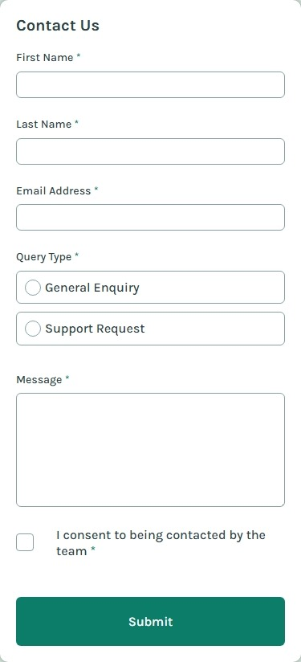
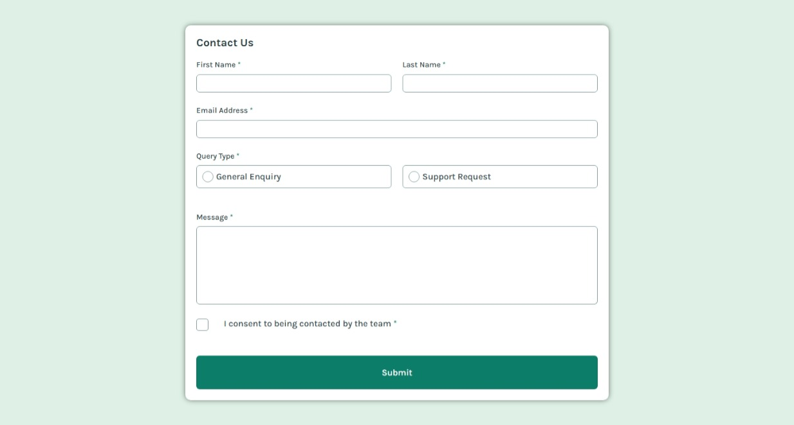
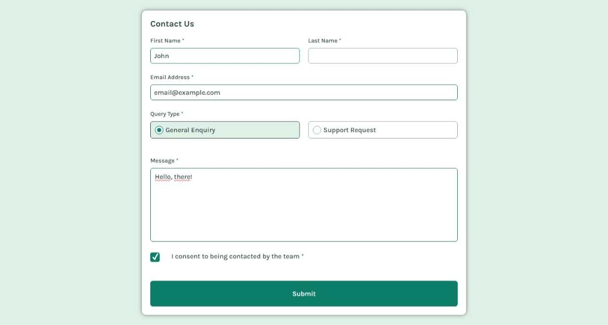
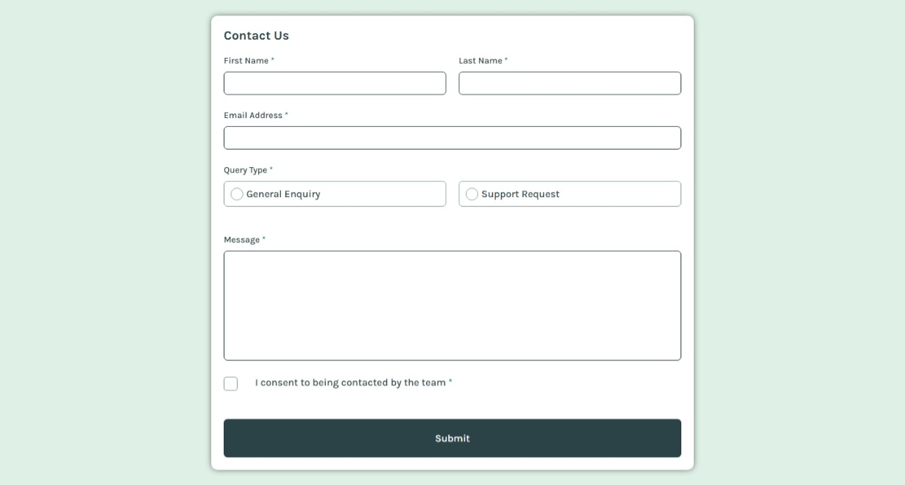
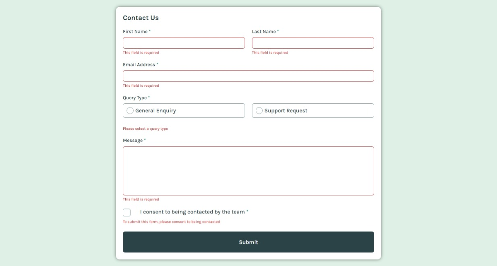

# contact-form-main

This is a solution to the [contact-form-main on Frontend Mentor](https://www.frontendmentor.io/challenges/contact-form--G-hYlqKJj). Frontend Mentor challenges help you improve your coding skills by building realistic projects. 

## Table of contents

- [Overview](#overview)
  - [Screenshot](#screenshot)
  - [Links](#links)
- [My process](#my-process)
  - [Built with](#built-with)
  - [What I learned](#what-i-learned)
  - [Continued development](#continued-development)
- [Author](#author)

## Overview

### Screenshot

These are my screenshots showing how the project turned out.

- Mobile design:



- Desktop design:



- Active state:



- Hover state:



- Error state:




### Links

- Solution URL: [My Solution](https://github.com/gillaercio/contact-form-main)

## My process

### Built with

- Semantic HTML5 markup
- CSS custom properties
- Flexbox
- CSS Grid
- Mobile-first workflow
- JavaScript

### What I learned

I took advantage of this project to practice using **Pseudo-class**, **Pseudo-elements** and **Reset CSS** with **CSS** and **Events** with **JavaScript**:

Pseudo-class

```css
.form__type > div:has(input[type="radio"]:checked) {
  border-color: var(--Lime);
  background-color: var(--Lime-alfa);
}
```
Pseudo-element

```css
*,
*::before,
*::after {
  margin: 0;
  padding: 0;
  box-sizing: border-box;
}
```

Events

```js
[firstName, lastName, email, message].forEach(field => {
  field.addEventListener('input', () => {
    if (field.value.trim() !== "") {
      field.classList.remove("input-error");
      document.getElementById(`error-${field.id.replace("form-", "")}`).textContent = "";
    }
  });
});
```

### Continued development

I would like to improve the use of the **HTML**, **CSS** and **JavaScript**.

## Author

- Frontend Mentor - [@gillaercio](https://www.frontendmentor.io/profile/gillaercio)
- Github - [My Github](https://github.com/gillaercio)
- LinkedIn - [My LinkedIn](https://www.linkedin.com/in/gildman-la%C3%A9rcio/)